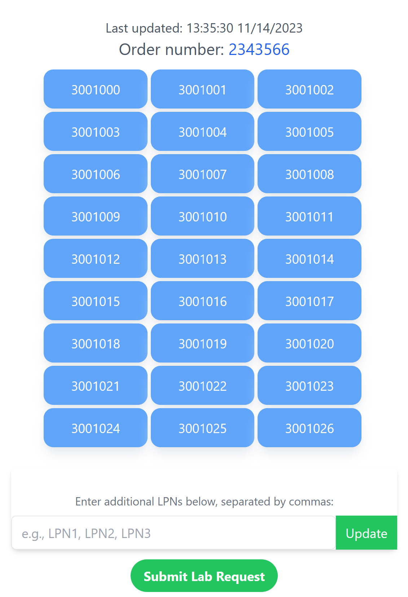

# Pallet Test

### Warehouse-to-Lab Sample Testing & Tracking

[![Contributors][contributors-shield]][contributors-url]
[![Forks][forks-shield]][forks-url]
[![Stargazers][stars-shield]][stars-url]
[![Issues][issues-shield]][issues-url]
[![LinkedIn][linkedin-shield]][linkedin-url]

[](https://opensource.org/licenses/MIT)
[](https://app.netlify.com/sites/pallettest/deploys)
<br />

<div align="center" id="readme-top">
  <a href="https://github.com/infiniteoo/lab_checks">
    
  </a>

  <h3 align="center">Pallet Test</h3>

  <p align="center">
    <br />
    <a href="https://github.com/infiniteoo/lab_checks"><strong>Explore the docs »</strong></a>
    <br />
    <br />
    <a href="https://pallettest.netlify.app">View Demo</a>
    ·
    <a href="https://github.com/infiniteoo/lab_checks/issues">Report Bug</a>
    ·
    <a href="https://github.com/infiniteoo/lab_checks/issues">Request Feature</a>
  </p>
</div>

## Introduction

Welcome to the Pallet Test, a comprehensive tool for testing and validating pallets in your supply chain. Whether you're involved in logistics, manufacturing, or shipping, this application aims to streamline and enhance the testing process for pallets.

### Note:

Items.csv is an example collection of pallets you can upload to create a new lab request. Inspect the format of the file to create your own custom requests.

## Features

- **Test Automation:** Easily automate the testing of pallets, saving time and reducing errors in the testing process.

From the Warehouse interface, upload the .csv file with your lab request pallets:

 

From the Laboratory interface, you can see all open orders:

  
  
A lab tech can approve or deny individual pallets:
  
  
  
Or pass/fail an entire collection:  
  
  

After the lab finishes, the warehouse can acknowledge the lab's results:

  

## Getting Started

- clone the repository
- install dependencies with npm/yarn install

* create a .env.local file in the root of your project
* make sure your .env.local file is being ignored in your .gitignore
* create a Supabase account, a project, and a table in your database
* create columns for the data (refer to /server/models/labRequests for Schema)
* don't forget to set up your RLS policy on the table
* enter your assigned URL and ANON key in the .env.local file:
* NEXT_PUBLIC_SUPABASE_URL=
* NEXT_PUBLIC_SUPABASE_ANON_KEY=

Run the development server:

```bash
npm run dev
# or
yarn dev
# or
pnpm dev
```

Open [http://localhost:3000](http://localhost:3000) with your browser to see the result.

### Built With

- [![Next][Next.js]][Next-url]
- [![React][React.js]][React-url]

## Learn More

To learn more about Next.js, take a look at the following resources:

- [Next.js Documentation](https://nextjs.org/docs) - learn about Next.js features and API.
- [Learn Next.js](https://nextjs.org/learn) - an interactive Next.js tutorial.

You can check out [the Next.js GitHub repository](https://github.com/vercel/next.js/) - your feedback and contributions are welcome!

<!-- ROADMAP -->

## Roadmap

- [x] Add Changelog
- [x] Add back to top links
- [ ] Add Additional Templates w/ Examples
- [ ] Add "components" document to easily copy & paste sections of the readme
- [ ] Multi-language Support
  - [ ] Chinese
  - [ ] Spanish

See the [open issues](https://github.com/othneildrew/Best-README-Template/issues) for a full list of proposed features (and known issues).

<p align="right">(<a href="#readme-top">back to top</a>)</p>

<!-- CONTACT -->

## Contact

Your Name - [@your_twitter](https://twitter.com/infiniteoo) - troydorman@gmail.com

Project Link: [https://github.com/infiniteoo/lab_checks](https://github.com/infiniteoo/lab_checks)

<p align="right">(<a href="#readme-top">back to top</a>)</p>

<!-- MARKDOWN LINKS & IMAGES -->
<!-- https://www.markdownguide.org/basic-syntax/#reference-style-links -->

[contributors-shield]: https://img.shields.io/github/contributors/infiniteoo/lab_checks.svg?style=for-the-badge
[contributors-url]: https://github.com/infiniteoo/lab_checks/graphs/contributors
[forks-shield]: https://img.shields.io/github/forks/infiniteoo/lab_checks.svg?style=for-the-badge
[forks-url]: https://github.com/infiniteoo/lab_checks/network/members
[stars-shield]: https://img.shields.io/github/stars/infiniteoo/lab_checks.svg?style=for-the-badge
[stars-url]: https://github.com/infiniteoo/lab_checks/stargazers
[issues-shield]: https://img.shields.io/github/issues/infiniteoo/lab_checks.svg?style=for-the-badge
[issues-url]: https://github.com/infiniteoo/lab_checks/issues
[license-shield]: https://img.shields.io/github/license/infiniteoo/lab_checks.svg?style=for-the-badge
[license-url]: https://github.com/infiniteoo/lab_checks/blob/master/LICENSE.txt
[linkedin-shield]: https://img.shields.io/badge/-LinkedIn-black.svg?style=for-the-badge&logo=linkedin&colorB=555
[linkedin-url]: https://linkedin.com/in/t-wayne-dormann
[product-screenshot]: images/screenshot.png
[Next.js]: https://img.shields.io/badge/next.js-000000?style=for-the-badge&logo=nextdotjs&logoColor=white
[Next-url]: https://nextjs.org/
[React.js]: https://img.shields.io/badge/React-20232A?style=for-the-badge&logo=react&logoColor=61DAFB
[React-url]: https://reactjs.org/
[Vue.js]: https://img.shields.io/badge/Vue.js-35495E?style=for-the-badge&logo=vuedotjs&logoColor=4FC08D
[Vue-url]: https://vuejs.org/
[Angular.io]: https://img.shields.io/badge/Angular-DD0031?style=for-the-badge&logo=angular&logoColor=white
[Angular-url]: https://angular.io/
[Svelte.dev]: https://img.shields.io/badge/Svelte-4A4A55?style=for-the-badge&logo=svelte&logoColor=FF3E00
[Svelte-url]: https://svelte.dev/
[Laravel.com]: https://img.shields.io/badge/Laravel-FF2D20?style=for-the-badge&logo=laravel&logoColor=white
[Laravel-url]: https://laravel.com
[Bootstrap.com]: https://img.shields.io/badge/Bootstrap-563D7C?style=for-the-badge&logo=bootstrap&logoColor=white
[Bootstrap-url]: https://getbootstrap.com
[JQuery.com]: https://img.shields.io/badge/jQuery-0769AD?style=for-the-badge&logo=jquery&logoColor=white
[JQuery-url]: https://jquery.com
